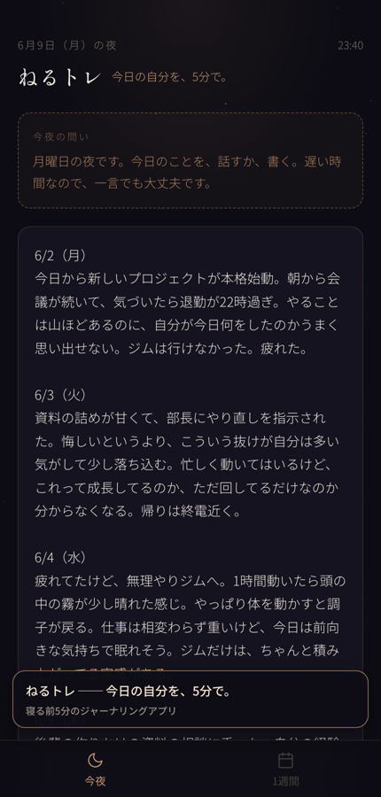
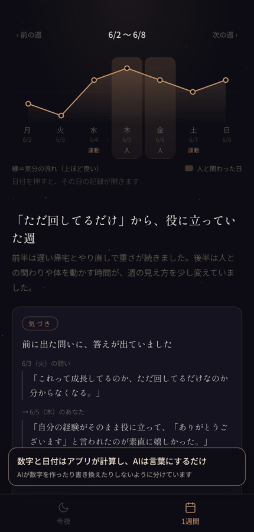
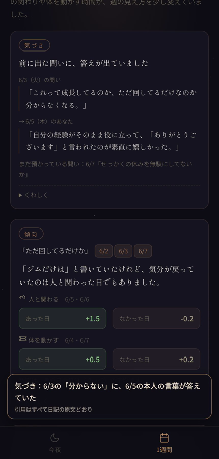
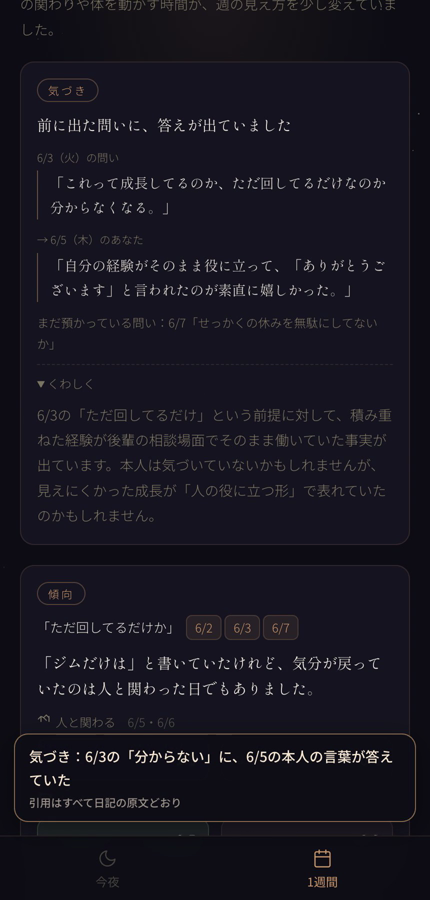
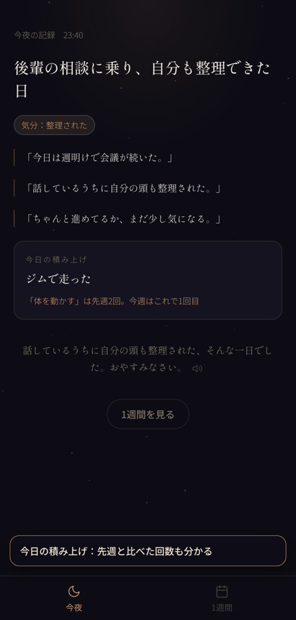

# ねるトレ

**今日の自分を、5分で。**

寝る前5分のジャーナリング（日記）アプリです。書いた日記をAIが読み、「書いた言葉どうしのつながり」を見せます。
HTMLファイル1つで動きます。サーバーもビルドも不要です。

第24回 DMM生成AI CAMP コンペ（AIジャーナリングアプリ）への提出作品です。

**デモ: https://hiwa-tech-1223.github.io/nerutore/**

APIキーなしで、そのままお試しいただけます（デモ用の中継サーバーを通してAIを呼んでいます）。
使いすぎを防ぐため、1日あたりの利用回数に上限があります。上限に達したときは、ご自分のキーを入力すれば続けて使えます。



## できること

- **今夜の問い** … 白紙で手が止まらないよう、これまでの記録から書き出しのきっかけを1つ出します。
- **1日分のまとめ** … 日記から、見出し・気分・本人の言葉の引用・心の声・今日の積み上げを取り出します。
- **1週間の振り返り** … 「気づき・傾向・変化」の3枚のカードにまとめます。
  - **気づき** … 前に出た問いに、後の日の言葉が答えていたことを見せます。
  - **傾向** … 何度も出ていた心の声と、気分が戻っていた日のつながりを見せます。
  - **変化** … 週の前半から後半への言葉の変化と、積み上がったものを見せます。
- **音声入力と読み上げ** … 話すだけでも記録できます。読み上げはボタンを押したときだけです。
- **書き忘れた日の記録** … 1行目に日付を書けばその日の分になります。何日分かまとめて貼ることもできます。

| 1週間の気分 | 気づき | 傾向 | 今夜のまとめ |
|---|---|---|---|
|  |  |  |  |

動作のようす（2分30秒）: [docs/demo.mp4](docs/demo.mp4)

## 使い方

1. [デモページ](https://hiwa-tech-1223.github.io/nerutore/) を開きます。キーの入力は要りません。
2. 今日のことを書くか、マイクで話して「送る」を押します。
3. 2日以上書いたら、「1週間」のタブで振り返りを作れます。

自分のキーで使う場合は、`nerutore.html` を `?demo=1` なしで開きます。最初にキーの入力画面が出ます。入力したキーは、そのブラウザにだけ保存されます。

記録はブラウザのlocalStorageに保存されます。サーバーには何も保存されません。

### 手元のファイルで動かす場合

ダウンロードした `nerutore.html` をダブルクリックで開くと、OpenAIへの通信がブラウザにブロックされ、AIの機能だけが動きません（画面は開きます）。
手元で動かすときは、簡単なサーバー経由で開いてください。

```bash
cd ダウンロードしたフォルダ
python3 -m http.server 8000
# ブラウザで http://localhost:8000/nerutore.html を開く
```

### 動作確認用のURLパラメータ

| パラメータ | はたらき |
|---|---|
| `?now=2025-06-09T23:40` | 現在日時を固定します。時刻や曜日に応じた動きを試せます。 |
| `?sample=1` | 入力欄にサンプル日記（7日分）を入れた状態で開きます。 |
| `?reset=1` | 保存データを消して開き直します。 |

## しくみ

AIへの依頼を4つに分け、計算と判定はアプリ側で確定させています。

| 依頼 | モデル | 渡すもの → 返るもの |
|---|---|---|
| 今夜の問い | gpt-4.1 | 時刻・前回の記録・預かった問い → 1〜2文の問い |
| 1日分のまとめ | gpt-4.1 | その日の日記 ＋ 預かっている問い → 構造化データ |
| 答え探し（伏線回収） | gpt-5.4 | 前に出た問い ＋ その後の日の本文 → 答えのかけら |
| 1週間の振り返り | gpt-5.4 | 集計した事実 ＋ 各日の記録 → 3枚のカードの言葉 |

- 日付・平均・回数はアプリが計算し、AIには「数値は書き換えないこと」と指示しています。
- AIが返した引用は、日記の原文と照らし合わせて一字一句そろえます。
- 分類（心の声・気分が戻ったきっかけ）は決まった語彙から選ばせ、日をまたいで数えられるようにしています。

AIの呼び出しは LangChain.js（CDNから読み込み）で組み立て、出力は JSON Schema の構造化出力で受け取ります。
読み込めない環境では、同じ指示と同じ形式で OpenAI API を直接呼びます。

## 安全のための設計

- 心の診断や、メンタルヘルスの助言はしません。
- 自分を傷つけることをうかがわせる言葉は、AIの判定とは別にアプリ側でも確認し、AIの返事を待たずに公的な相談窓口を案内します。
- 相談窓口の名前と電話番号はアプリ内に直接書いてあり、AIには書かせません。

## ファイル

| ファイル | 内容 |
|---|---|
| [nerutore.html](nerutore.html) | アプリ本体（単一HTML）。APIキーは空にしてあります。 |
| [index.html](index.html) | デモページを開いたときに、アプリへ転送するだけのページ。 |
| [demo-proxy/](demo-proxy/) | デモ用の中継サーバー（Cloudflare Worker）。キーはサーバー側に置き、ブラウザには渡しません。 |
| [docs/design-notes.md](docs/design-notes.md) | 制作判断メモ。何を記録するアプリか、プロンプトの狙い、UXの工夫。 |
| [docs/prompts.txt](docs/prompts.txt) | AIへの指示（プロンプト）の全文と、渡している情報の設計。 |
| [docs/video-script.md](docs/video-script.md) | 動作動画の台本。 |
| [docs/demo.mp4](docs/demo.mp4) | 動作動画（2分30秒・音声なし）。 |

## 必要なもの

- OpenAI APIキー（gpt-4.1 / gpt-5.4 / gpt-4o-mini-transcribe / gpt-4o-mini-tts を使います）
- 最近のブラウザ（Chrome、Safari、Edge など）

## 注意

- このアプリは記録のためのもので、診断や治療のためのものではありません。
- サンプル日記は、コンペ運営から提供された審査用のものです。
